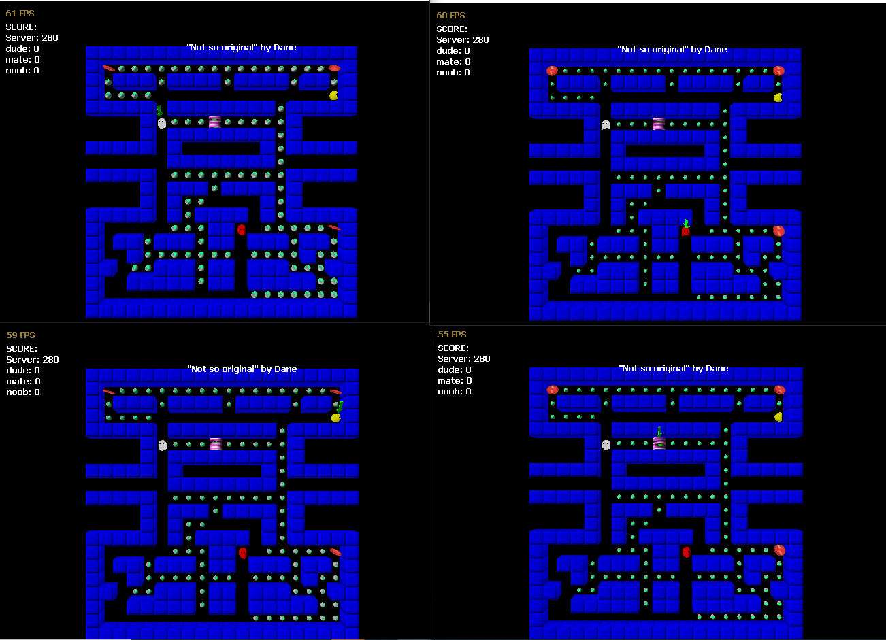

# NetPac

A clone of the original that you can play over the network.

## How to play

If you are the server you will start as pacman, otherwise you will start as a ghost. If you are a ghost and you kill pacman you will become pacman. If you are pacman you will get points for eating dots, and if you eat a pill you will be able to kill ghosts for the next 3 seconds. Eaten ghosts will go to the holding bay for 5 seconds. If you go off the top of the screen you will teleport to the bottom and vice versa, the same goes for left/right of the screen.

## Controls

- Move: Keyboard Arrows
- Toggle Sound FX: F
- Change Camera: C
  - Zoom Camera: Q/E
  - Rotate Level: W/A/S/D
- Server
  - Next Level: Space
  - Add Bot: B
  - Kill Bot: K

## Scoring

- Eat Dot: 5 Points
- Eat Pill: 10 Points
- Kill: 15 points

## Custom Levels

Making levels is easy, they are .txt files with characters representing game elements. The levels are stored in the media folder named level0.txt level1.txt level2.txt etc. I recommend using a plain text editor with insert enabled so you can type over the existing characters and editing level0.txt as this is the first level when you run the game in server mode. The levels are 20x20 characters, with the 21st line reserved for your level title. If your level is not the full 20x20 pad it with the extra spaces needed. Here is the characters to use:

- X = Wall
- . = Dot
- O = Pill
- P = Pacman start
- G = Ghost holding area
- S = Ghost start area

The levels must have at least one dot/pill and exactly one of each P/G/S.

## Changing the server listen address

Edit media/serverip.txt.

## About me

My name is Dane and I am currently studying at the AIE in Canberra 2007 :)
